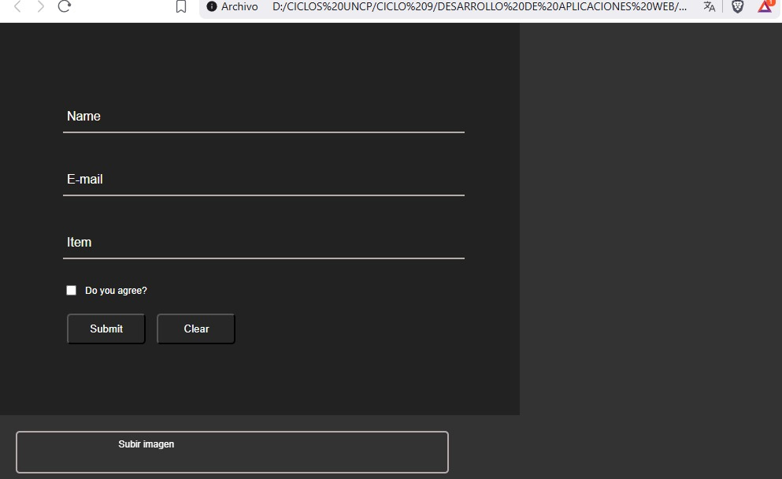
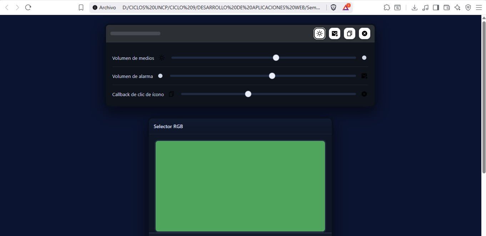
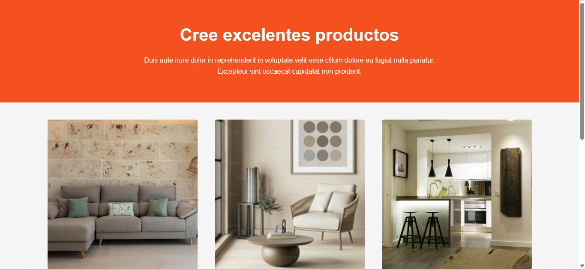
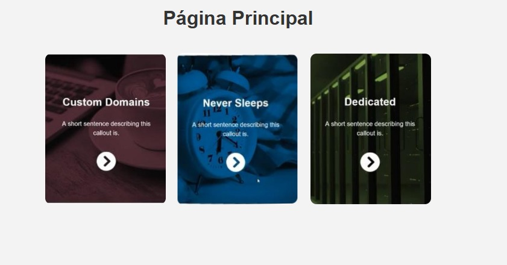
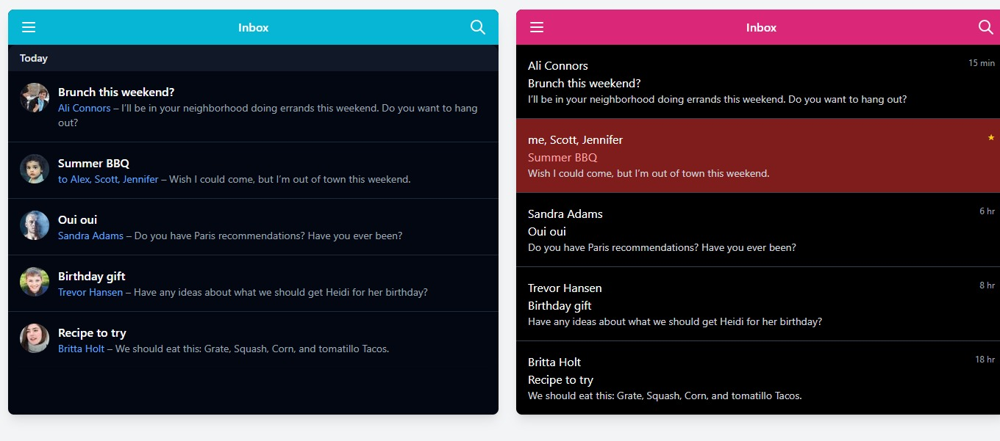
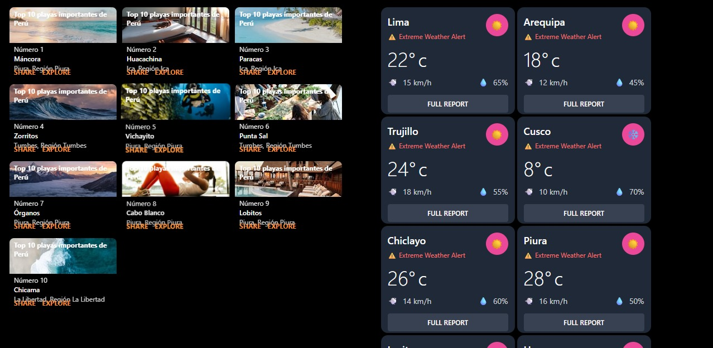
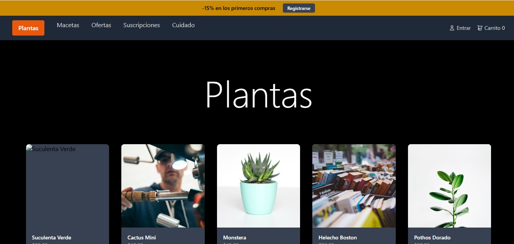
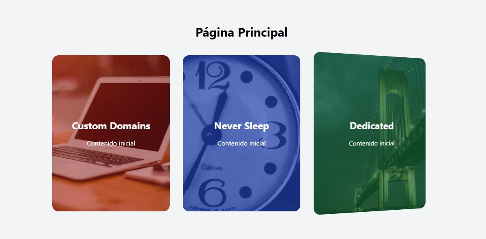

# Semana 03 – Ejercicios Prácticos de HTML y CSS

---

**Page01.html – Formulario con Animaciones y Campo Drag & Drop**

En este ejercicio se diseñó una ventana en HTML y CSS puro, sin usar ninguna librería adicional.  
La interfaz contiene cuatro iconos SVG y un formulario con tres campos de texto, un checkbox y dos botones.  
El objetivo principal fue aplicar animaciones en los campos del formulario. Al hacer clic en un campo, el texto de su etiqueta se desplaza hacia la parte superior del campo y cambia su color, al igual que la línea inferior, logrando un efecto visual atractivo y moderno.  
Además, se añadió un campo de imagen del mismo ancho de los text fields, con una altura de 50px y un logo SVG centrado vertical y horizontalmente. Este campo permite realizar una acción de arrastrar y soltar (drag and drop) para subir imágenes, mostrando posteriormente la ruta del archivo cargado.
**📸 Imagen del ejercicio:**  

---

**Page02.html – Formulario y Card con Control de Color RGB**

El segundo ejercicio consistió en continuar el diseño con HTML y CSS puro, agregando un card dividido en dos partes.  
La primera parte es un rectángulo con bordes redondeados que muestra un color.  
La segunda parte incluye tres sliders y tres campos numéricos (valores del 0 al 255) que permiten modificar el color del rectángulo en tiempo real, simulando la mezcla de colores en el modelo RGB.  
Este ejercicio buscó reforzar la interacción entre elementos visuales y su personalización a través de estilos dinámicos.

**📸 Imagen del ejercicio:**  

---

**Page03.html – Página Completa con Diseño, Hover y Responsividad**

En este ejercicio se desarrolló una página web completa con textos, colores, fondos e imágenes, manteniendo una distribución visual equilibrada.  
Al pasar el cursor sobre las imágenes, estas aumentan su opacidad en un 10%, generando una sensación de realce e interactividad.  
Asimismo, se implementó un diseño responsivo mediante el uso de flexbox y media queries, adaptando el contenido según el tamaño de la pantalla: pequeño (menor a 480px), mediano (menor a 900px), grande (menor a 1200px) y extra grande (mayor a 1200px).  
Este ejercicio enfatizó la importancia de la adaptabilidad y experiencia de usuario en distintos dispositivos.
**📸 Imagen del ejercicio:**  

---

**index.html – Cards Animados con Enlaces a las Páginas**

El cuarto ejercicio tuvo como objetivo crear una página principal con tres cards animados que enlazan a las páginas page1.html, page2.html y page3.html respectivamente.  
Cada card muestra su título correspondiente (Page1, Page2, Page3) y presenta una animación de giro de 180° sobre sus ejes horizontal y vertical.  
El efecto de rotación permite visualizar la parte trasera del card, donde se encuentra el enlace a la página, generando un efecto 3D elegante.  
Este ejercicio permitió aplicar animaciones avanzadas y navegación estructurada dentro del sitio web.

**📸 Imagen del ejercicio:**  

---

**Ejercicios del Día Jueves – Diseño con Grid y Tailwind CSS**

Durante la sesión del día jueves se trabajaron nuevos ejercicios utilizando HTML y Tailwind CSS, aplicando principios de maquetación con grid y flexbox, además de diseño responsivo.

---

**Page01.html – Diseño de Lista con Grid Responsivo y Tailwind**

Esta página fue dividida en dos columnas y una fila mediante grid.  
Cada lista ocupa el 60% de su columna si la pantalla es mayor a 1400px, el 50% si la pantalla está entre 701 y 1399px, y el 100% si es menor a 700px.  
Cada entrada incluye un icono SVG, el asunto del mensaje (en negrita), el remitente y un fragmento del contenido como vista previa.  
El diseño aplica los colores, formas y estilos definidos utilizando Tailwind, logrando una presentación limpia y moderna.
**📸 Imagen del ejercicio:**  

---

**Page02.html – Cards con Información de Playas y Ciudades del Perú**

En esta página se diseñaron dos tipos de cards utilizando HTML y Tailwind CSS.  
El primer tipo muestra información de las diez playas más importantes del Perú, distribuidas con flexbox y separadas uniformemente.  
Cada card contiene cuatro imágenes y botones de interacción (*share* y *explore*), los cuales cambian de color a un tono gris claro cuando el cursor pasa sobre ellos.  
El segundo tipo presenta información de las diez ciudades más importantes del Perú con un diseño similar.  
Ambos ejercicios aplican principios de simetría, separación y equilibrio visual.
**📸 Imagen del ejercicio:**  

---

**Page03.html – Página Completa con Tailwind y Responsividad**

En esta página se aplicaron los conocimientos de diseño responsivo utilizando Tailwind CSS.  
Se trabajó con elementos de texto, fondo, colores e imágenes similares al diseño base.  
Cuando el usuario pasa el cursor sobre una imagen, esta aumenta su opacidad en un 15%, aportando dinamismo y un mejor enfoque visual.  
La distribución se adapta automáticamente mediante flexbox y media queries para ofrecer una correcta visualización en distintos tamaños de pantalla.

**📸 Imagen del ejercicio:**  

---

**index.html – Cards Animados de Navegación**

Finalmente, se elaboró nuevamente la página index.html, esta vez aplicando estilos con Tailwind CSS.  
Se diseñaron tres cards animados que enlazan a las páginas page1.html, page2.html y page3.html.  
Cada card cuenta con una animación de giro 3D sobre su eje horizontal y vertical, con una transición fluida, reforzando la navegación dinámica y moderna dentro del sitio web.
**📸 Imagen del ejercicio:**  

---

**Conclusión de la Semana**

Durante esta semana se trabajó en la creación de interfaces web interactivas, aplicando principios avanzados de HTML, CSS y Tailwind CSS.  
Se profundizó en temas de animaciones, responsividad, estructura visual y experiencia de usuario.  
Los ejercicios permitieron consolidar conocimientos sobre formularios, grid, flexbox, efectos hover y adaptabilidad en diferentes resoluciones, logrando una base sólida para el desarrollo web profesional.

---
