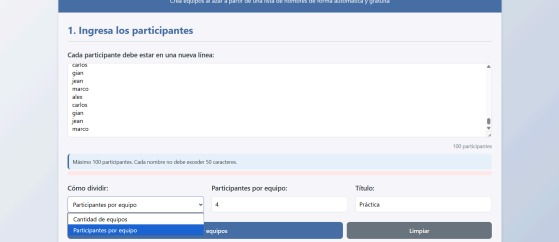

# Semana de Ejercicios Prácticos: HTML, CSS y JavaScript Integrado

Durante esta semana, se pusieron en práctica los conocimientos de **HTML, CSS y JavaScript**, desarrollando dos aplicaciones web completas que combinan las tres tecnologías para generar interactividad, almacenamiento local y manipulación dinámica del DOM.

---

## Ejercicio 1: Aplicación Web con Ruleta Dinámica

### Objetivo
Diseñar una **ruleta interactiva** que permita seleccionar un elemento aleatoriamente entre una lista ingresada por el usuario en un **TextArea**. Esta aplicación simula un sorteo dentro de una **aula virtual**.

### 🔧 Funcionalidades Principales

#### F1 – Ruleta dinámica
La ruleta está dividida en sectores de colores. Cada elemento se genera dinámicamente según los datos ingresados en el **TextArea**, utilizando cinco colores básicos que se repiten si hay más de cinco elementos.

#### F2 – Animación de giro
Al hacer clic sobre la ruleta, presionar la tecla **Espacio (Space)** o el botón **Iniciar**, la ruleta gira aleatoriamente hasta detenerse en un elemento seleccionado, el cual se muestra en pantalla.

#### F3 – Integración con TextArea
El **TextArea** funciona como fuente de datos para la ruleta. Cada línea representa un participante o ítem del sorteo.

#### F4 – Guardado en LocalStorage
Los datos ingresados en el TextArea se guardan automáticamente en el **Local Storage**, permitiendo recuperarlos al volver a abrir la página.

#### F5 – Actualización automática
Cualquier cambio en el TextArea actualiza la ruleta de forma inmediata, garantizando sincronización entre la lista y el diseño visual.

#### F6 – Resaltado de elementos
Pulsando la tecla **S**, el último elemento sorteado se resalta en gris dentro del TextArea y se oculta en la ruleta, evitando su participación en el siguiente sorteo.

#### F7 – Modo de edición
Presionando la tecla **E** o haciendo clic sobre el TextArea, se activa el modo de edición, permitiendo escribir, copiar o pegar nuevos datos.

#### F8 – Reinicio del sorteo
Con la tecla **R** o el botón **Reiniciar**, todos los elementos vuelven a ser visibles y el resaltado desaparece, dejando la ruleta lista para un nuevo sorteo.

#### F9 – Pantalla completa
Pulsando la tecla **F**, la aplicación entra en modo de **pantalla completa**, permitiendo visualizar la ruleta sin distracciones.

**📸 Imagen del ejercicio:**  

---

---

## Ejercicio 2: Aplicación para Sorteo de Equipos

### Objetivo
Crear una aplicación que genere equipos de manera aleatoria a partir de una lista de participantes. El objetivo es automatizar el proceso de formación de grupos.

### Funcionalidades Principales

#### F1 – Lista editable
Se utiliza un **TextArea** para ingresar hasta 100 participantes, con un límite de 50 caracteres por línea.  
Los datos se almacenan y recuperan desde el **Local Storage**, garantizando persistencia de la información.

#### F2 – Configuración del sorteo
El usuario puede elegir si desea definir el sorteo por:
- Cantidad de **equipos a generar**, o  
- Cantidad de **participantes por equipo**.  

Además, se puede **asignar un título** personalizado a los equipos.

#### F3 – Generación aleatoria
Al pulsar el botón **Generar**, se inicia el sorteo mostrando una nueva pantalla donde se distribuyen los participantes de manera aleatoria dentro de cada equipo.  
Cada grupo aparece en un **rectángulo con subtítulo** que indica el número del equipo.

#### F4 – Opciones finales
En la parte inferior de la pantalla se añaden tres botones:
- **Descargar JPG:** para guardar el resultado como imagen.  
- **Copiar al portapapeles:** para usar los resultados en otra aplicación.  
- **Copiar equipos por columna:** para exportar fácilmente los grupos formados.

---
**📸 Imagen del ejercicio:**  

---

# Tema Desarrollado: Introducción a Node.js y React

##  Node.js

### ¿Qué es?
**Node.js** es un entorno de ejecución que permite usar **JavaScript del lado del servidor**.  
Funciona sobre el motor **V8 de Google Chrome** y permite crear aplicaciones escalables y rápidas.

### Características principales
- Ejecución **asíncrona y basada en eventos**.  
- Ideal para **servidores, APIs y aplicaciones en tiempo real**.  
- Permite manejar **archivos, bases de datos y peticiones HTTP**.

### Instalación
1. Descargar desde la web oficial: [https://nodejs.org](https://nodejs.org)  
2. Instalar siguiendo los pasos del asistente.  
3. Verificar instalación con los comandos:
   - `node -v`
   - `npm -v`
4. Ya se podrá usar **npm (Node Package Manager)** para instalar paquetes y frameworks.

---

## ⚛️ React.js

### Descripción
**React** es una biblioteca de JavaScript desarrollada por **Meta (Facebook)** para construir **interfaces de usuario interactivas** y **componentes reutilizables**.

### Instalación y ejecución
Para crear un nuevo proyecto React:
1. Ejecutar el comando: `npx create-react-app nombreProyecto`  
2. Entrar al directorio del proyecto: `cd nombreProyecto`  
3. Iniciar el entorno de desarrollo: `npm start`  

React organiza el código en **componentes**, facilitando el mantenimiento y escalabilidad de la aplicación.

---

## Vite

### Descripción
**Vite** es una herramienta moderna para construir proyectos de **React, Vue o Vanilla JS** con una carga ultrarrápida gracias a su sistema basado en **ES Modules** y **Hot Module Replacement (HMR)**.

### Creación de proyecto con Vite
1. Crear el proyecto: `npm create vite@latest nombreProyecto`  
2. Entrar al directorio: `cd nombreProyecto`  
3. Instalar dependencias: `npm install`  
4. Ejecutar el servidor local: `npm run dev`  

Vite es más rápido que Create React App y ofrece una mejor experiencia de desarrollo.

---

## Next.js

### Descripción
**Next.js** es un framework de **React** que permite crear aplicaciones con **renderizado del lado del servidor (SSR)**, **rutas automáticas** y **optimización SEO**.

### Instalación básica
1. Crear un nuevo proyecto: `npx create-next-app`  
2. Next configura automáticamente un entorno completo con soporte para páginas, API y estilos.  
3. Es ideal para **sitios web dinámicos, dashboards y aplicaciones empresariales**.

---

## Conclusión

Durante esta semana se aplicaron los conocimientos fundamentales de **HTML, CSS y JavaScript** para crear aplicaciones dinámicas e interactivas.  
Además, se introdujeron herramientas avanzadas como **Node.js, React, Vite y Next.js**, que amplían las capacidades del desarrollo web hacia entornos más modernos, modulares y eficientes.
