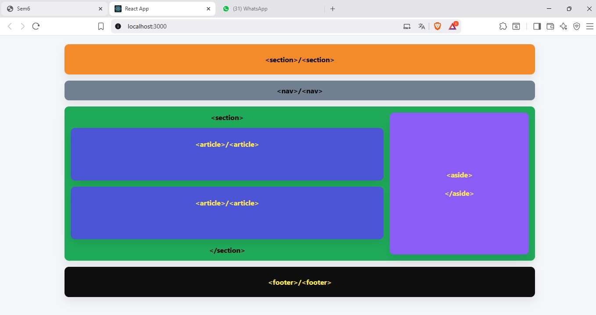
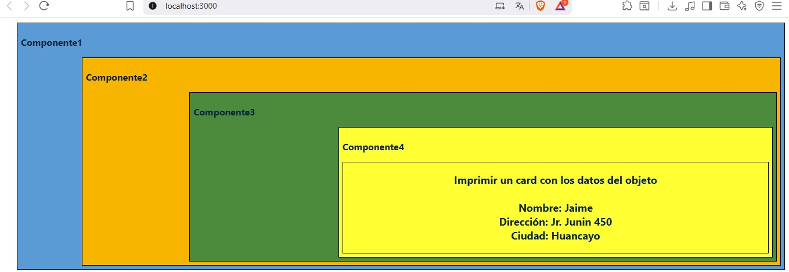
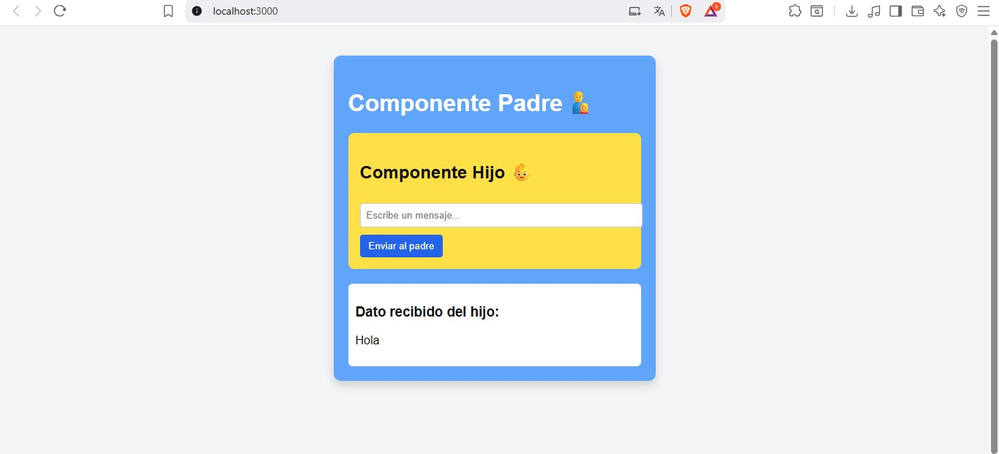
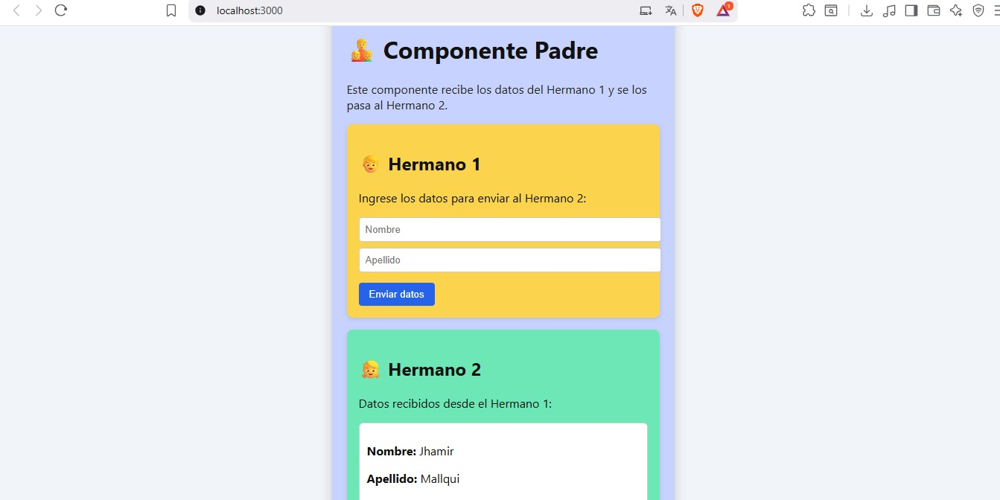
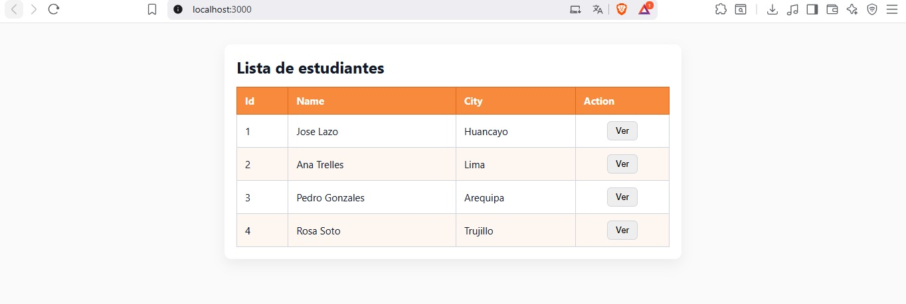

# Semana 06 - Conociendo el entorno de desarrollo en React (Vite)

##  Objetivo de la semana
Durante esta semana aprendimos a trabajar con **React** utilizando **Vite**, explorando cómo se crea y organiza un proyecto moderno, los principales archivos del entorno y cómo ejecutar la aplicación desde diferentes puertos.

---

##  Creación de carpetas y estructura del proyecto

Se creó la estructura base del proyecto React con las siguientes carpetas:

- `src/` → Contiene el código fuente de la aplicación.  
- `components/` → Guarda los componentes reutilizables.  
- `assets/` → Almacena imágenes, íconos o recursos multimedia.  
- `pages/` → Contiene las páginas principales del sitio.

Archivos principales del entorno:
- **`index.html`** → Punto de entrada del proyecto.  
- **`main.jsx`** → Donde se monta el componente raíz (`App.jsx`).  
- **`App.jsx`** → Contiene la estructura principal del código.  
- **`vite.config.js`** → Configuración del entorno Vite.  
- **`package.json`** → Lista las dependencias y scripts.

Para ejecutar el proyecto se utilizó el comando:

```bash
npm run dev
```
# 💻 Ejercicios de Laboratorio

---

##  Ejer01 - Diseño responsivo con componentes

Se desarrolló una aplicación web en **React** con un diseño **responsivo** para PC, tablet y móvil.  
El proyecto incluye **7 componentes** (uno por cada sección), aplicando **CSS puro** para lograr la distribución visual.

**📸 Imagen del ejercicio:**  


---

##  Ejer02 - Componentes anidados y paso de datos (props)

Se construyó una aplicación con **4 componentes anidados**, donde:

- El **componente 1** envía un objeto con datos (`nombre`, `dirección`, `ciudad`).
- Los datos viajan hasta el **componente 4**, que los muestra en un **card visual**.

** Imagen del ejercicio:**  


---

## Ejer03 - Comunicación entre padre e hijo

En este ejercicio se trabajó con **dos componentes**:

- El **hijo** envía información al padre mediante *props*.  
- El **padre** recibe los datos y los muestra dinámicamente.  

Este ejemplo refuerza el manejo de datos entre componentes y el **flujo unidireccional de React**.

**📸 Imagen del ejercicio:**  


---

## Ejer04 - Listado de estudiantes

Se desarrolló una tabla que muestra los datos de un objeto con los campos:  
`id`, `name` y `city`.  
Los datos fueron renderizados usando componentes y mostrados dentro de una tabla con estilos en **CSS**.

**📸 Imagen del ejercicio:**  


---

## Ejer05 - Componentes hermanos y paso de datos

En este último ejercicio, se trabajó con **componentes hermanos**, donde los datos se envían desde un componente hacia otro mediante el **componente padre**.  
Cada componente hermano muestra la información recibida de manera independiente.

**📸 Imagen del ejercicio:**  


